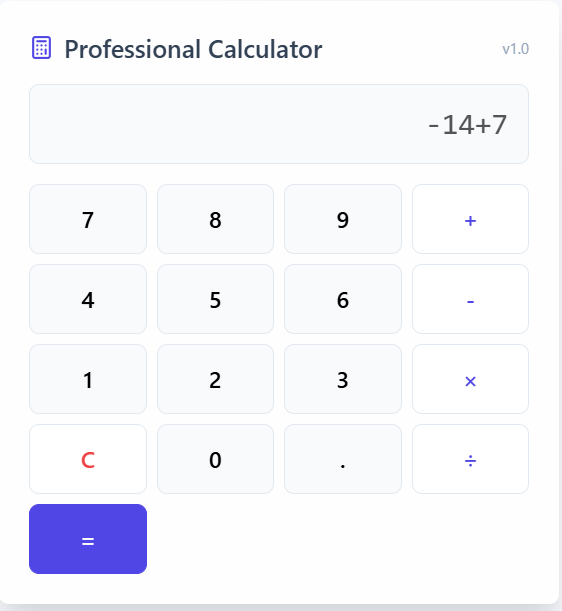

1 **Requirement ID**: [REQ-44]  
**Description**: [Multiplication seems to subtract instead]

A. **Steps to Reproduce**:  
1. Open `calculator.html`  
2. Enter: `12 * 12`  
3. Press: `=`

**Expected**: 144  
**Actual**: 0  
**Repro Rate**: 100%  
**Severity**: High

B. **Steps to Reproduce**:  
1. Open `calculator.html`  
2. Enter: `-1.3 * 7.8 `  
3. Press: `=`

**Expected**: -10.14  
**Actual**: -9.1  
**Repro Rate**: 100%  
**Severity**: High

C. **Steps to Reproduce**:  
1. Open `calculator.html`  
2. Enter: `16 * 0`  
3. Press: `=`

**Expected**: 0 
**Actual**: 16 
**Repro Rate**: 100%  
**Severity**: High

**Screenshot**:  

2 **Requirement ID**: [REQ-45]  
**Description**: [Addition gives +1 error]

A. **Steps to Reproduce**:  
1. Open `calculator.html`  
2. Enter: `22 + 11`  
3. Press: `=`

**Expected**: 33 
**Actual**: 34  
**Repro Rate**: 100%  
**Severity**: High

B. **Steps to Reproduce**:  
1. Open `calculator.html`  
2. Enter: `-14 + 7`  
3. Press: `=`

**Expected**: -7
**Actual**: -6  
**Repro Rate**: 100%  
**Severity**: High

C. **Steps to Reproduce**:  
1. Open `calculator.html`  
2. Enter: `4.8 + 8.16`  
3. Press: `=`

**Expected**: 12.96 
**Actual**: 13.96  
**Repro Rate**: 100%  
**Severity**: High

**Screenshot**:  

3 **Requirement ID**: [REQ-46]  
**Description**: [Division seems to multiply instead]

A. **Steps to Reproduce**:  
1. Open `calculator.html`  
2. Enter: `4 / 2`  
3. Press: `=`

**Expected**: 2  
**Actual**: 8  
**Repro Rate**: 100%  
**Severity**: High

B. **Steps to Reproduce**:  
1. Open `calculator.html`  
2. Enter: `4 / 0 `  
3. Press: `=`

**Expected**: error  
**Actual**: 0  
**Repro Rate**: 100%  
**Severity**: High

C. **Steps to Reproduce**:  
1. Open `calculator.html`  
2. Enter: `9 / 2`  
3. Press: `=`

**Expected**: 4.5  
**Actual**: 18  
**Repro Rate**: 100%  
**Severity**: High

**Screenshot**:  

4  **Requirement ID**: [REQ-47]  
**Description**: [Lack of errors]

A. **Steps to Reproduce**:  
1. Open `calculator.html`  
2. Enter: `4 ++ 2`  
3. Press: `=`

**Expected**: error  
**Actual**: 5 
**Repro Rate**: 100%  
**Severity**: High

B. **Steps to Reproduce**:  
1. Open `calculator.html`  
2. Enter: `9 + `  
3. Press: `=`

**Expected**: error  
**Actual**: 10 
**Repro Rate**: 100%  
**Severity**: High

**Screenshot**:  

